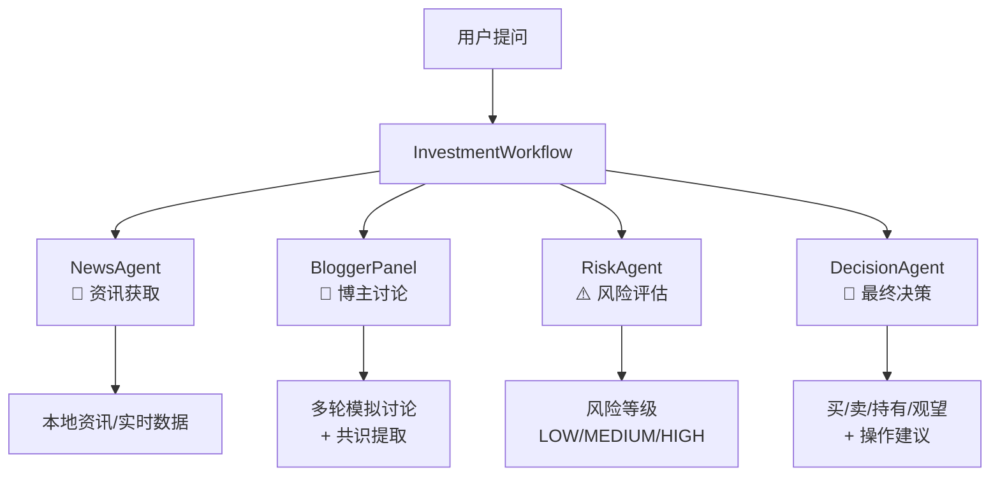
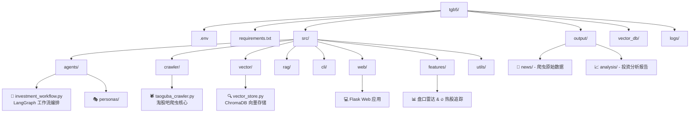

<div align="center">

# 🚀 淘股宝 - 多 Agent 投资分析系统

[](https://opensource.org/licenses/MIT)
[](https://www.python.org/downloads/)
[](https://github.com/langchain-ai/langgraph)
[](https://www.trychroma.com/)
[](https://taogubao-b6n9.vercel.app/)

[](https://taogubao-b6n9.vercel.app/)

基于淘股吧数据的多 Agent 协作投资分析系统。通过爬取淘股吧博主帖子，结合大语言模型模拟多人讨论，自动生成包含资讯汇总、博主观点、风险评估和最终决策的投资分析报告。

---

</div>

### 🌟 🚀 免费在线版本

无需安装，直接访问 [**🌐 在线演示**](https://taogubao-b6n9.vercel.app/) 即可使用！

> ⚠️ **注意**：在线版本由于 Vercel 部署限制，**爬虫功能已禁用**，只能使用手动输入资讯和 AI 生成资讯功能。如需使用完整功能（包括爬虫），请按照下方指南本地部署。

---

</div>

## 🏗️ 系统架构

```
用户提问
   │
   ▼
┌─────────────────────────────────────────────────────────┐
│                  InvestmentWorkflow                       │
│                   (LangGraph 编排)                       │
│                                                         │
│  ┌──────────┐   ┌──────────────┐   ┌──────────┐   ┌──────────────┐
│  │NewsAgent │──▶│BloggerPanel  │──▶│RiskAgent │──▶│DecisionAgent │
│  │ 资讯获取  │   │  博主讨论     │   │ 风险评估  │   │  最终决策     │
│  └──────────┘   └──────────────┘   └──────────┘   └──────────────┘
│       │               │                                  │
│       ▼               ▼                                  ▼
│  本地资讯/       多轮模拟讨论                       买/卖/持有/观望
│  实时数据        + 共识提取                          + 操作建议
└─────────────────────────────────────────────────────────┘
```

### 🔄 工作流程

<div align="center">
  


</div>

1. **📰 NewsAgent** — 搜集市场资讯，生成市场摘要；支持手动输入、从帖子导入、AI 生成资讯
2. **💬 BloggerPanel** — 多个博主人格 Agent 进行多轮讨论，提取市场共识
3. **⚠️ RiskAgent** — 评估市场风险，输出风险等级（LOW/MEDIUM/HIGH）和风险警告
4. **🎯 DecisionAgent** — 综合前三步信息，做出最终投资决策和具体操作建议

## ✨ 核心功能

<div align="center">
  <table>
    <tr>
      <td align="center" width="25%">
        <strong>🤖 多 Agent 协作</strong><br>
        <small>四步工作流自动生成投资报告</small>
        <div>
          <span>✅ 本地版本</span> / 
          <span>🌐 在线版本</span>
        </div>
      </td>
      <td align="center" width="25%">
        <strong>🎭 博主人格模拟</strong><br>
        <small>支持自定义博主人格，模拟多角度市场讨论</small>
        <div>
          <span>✅ 本地版本</span> / 
          <span>🌐 在线版本</span>
        </div>
      </td>
      <td align="center" width="25%">
        <strong>🔍 RAG 智能问答</strong><br>
        <small>基于向量数据库的知识检索增强生成</small>
        <div>
          <span>✅ 本地版本</span> / 
          <span>🌐 在线版本</span>
        </div>
      </td>
      <td align="center" width="25%">
        <strong>🕷️ 精品帖子爬虫</strong><br>
        <small>支持多博主批量采集，含帖子正文与评论</small>
        <div>
          <span>✅ 本地版本</span> / 
          <span>❌ 在线版本</span>
        </div>
      </td>
    </tr>
  </table>
</div>

## 🚀 扩展功能

<div align="center">
  <table>
    <tr>
      <td align="center" width="33%">
        <strong>📊 盘口雷达</strong><br>
        <small>A 股日线数据筛选工具<br/>支持 8 种涨幅排名规则</small>
        <div>
          <span>✅ 本地版本</span> / 
          <span>❌ 在线版本</span>
        </div>
      </td>
      <td align="center" width="33%">
        <strong>🔥 人气热股</strong><br>
        <small>东财 + 同花顺双榜<br/>实时追踪，自动取交集</small>
        <div>
          <span>✅ 本地版本</span> / 
          <span>❌ 在线版本</span>
        </div>
      </td>
      <td align="center" width="33%">
        <strong>💻 Web 可视化界面</strong><br>
        <small>仪表盘、投资分析、资讯配置<br/>历史报告一站式管理</small>
        <div>
          <span>✅ 本地版本</span> / 
          <span>🌐 在线版本</span>
        </div>
      </td>
    </tr>
  </table>
</div>

---

## 📋 版本差异

| 功能 | 🌐 在线版本 | 💻 本地版本 |
|------|------------|-------------|
| 🤖 投资分析工作流 | ✅ 支持 | ✅ 支持 |
| 📝 手动输入资讯 | ✅ 支持 | ✅ 支持 |
| 🤖 AI 生成资讯 | ✅ 支持 | ✅ 支持 |
| 🕷️ 爬取帖子 | ❌ 已禁用 | ✅ 支持 |
| 📊 盘口雷达 | ❌ 已禁用 | ✅ 支持 |
| 🔥 人气热股 | ❌ 已禁用 | ✅ 支持 |
| 💻 完整界面 | ✅ 基础功能 | ✅ 所有功能 |

---

</div>

## 🚀 快速开始

### 📦 1. 安装依赖

```bash
# 克隆项目
git clone <repository-url>
cd taogubao

# 创建虚拟环境（推荐使用 conda）
conda create -n taogubao python=3.10  # 如果卡住，请关闭代理
conda activate taogubao

# 安装依赖（注意打开requirements.txt中的注释，总依赖大小约 500MB）
pip install -r requirements.txt --no-deps
```

### 🔑 2. 配置 API Key

```bash
# 复制环境变量模板
cp .env.example .env
```

Windows 用户：
```cmd
copy .env.example .env
```

**至少配置一个 LLM 提供商的 API Key：**

> ⭐ **推荐使用的 API**（已调试通过）：
> - 🇨🇳 **智谱 AI (zhipu)**：中文优化效果好
> - ☁️ **通义千问 (qwen)**：阿里出品，稳定可靠  
> - 🔍 **DeepSeek**：性价比高，响应快
> - 🔗 **OpenRouter**：支持多种模型，免费额度充足

```env
# 🤖 默认 LLM 提供商（可选：zhipu, deepseek, openai, qwen, minimax, kimi, openrouter）
# 注意：其他厂商虽然代码里接入了，但没有实际运行测试
DEFAULT_LLM_PROVIDER=zhipu

# 🔗 OpenRouter（推荐，支持多种模型）
OPENROUTER_API_KEY=your_openrouter_key
OPENROUTER_MODEL=z-ai/glm-4.5-air:free

# 🇨🇳 智谱 AI
ZHIPU_API_KEY=your_zhipu_key
ZHIPU_MODEL=glm-4.5-air

# ☁️ 通义千问
QWEN_API_KEY=your_qwen_key
QWEN_MODEL=qwen3.5-flash

# 🔍 DeepSeek
DEEPSEEK_API_KEY=your_deepseek_key

# 🌐 OpenAI
OPENAI_API_KEY=your_openai_key

# 🎭 MiniMax
MINIMAX_API_KEY=your_minimax_key

# 🌙 Kimi (Moonshot)
KIMI_API_KEY=your_kimi_key
```

### 🌐 3. 启动 Web 界面

```bash
# 默认端口 5000
python -m src.web.app

# 指定端口
python -m src.web.app --port 5001
```

🎉 **浏览器打开** `http://localhost:5000`，即可使用可视化界面！

### 📊 4. 运行投资分析（命令行）

```bash
# 运行完整的四步投资分析流程
python -m src.cli.run_workflow
```

✅ 分析报告自动保存到 `output/analysis/` 目录。

## 🤖 支持的 LLM 提供商

<div align="center">
  
> 📝 **说明**：以下 LLM 提供商均已接入代码，但仅 **⭐ 标注的四个** 已实际调试运行
  
| 提供商 | Provider | Base URL | 环境变量 | 默认模型 | 🌟 特点 |
|--------|----------|----------|----------|----------|---------|
| ⭐**OpenRouter** | `openrouter` | `https://openrouter.ai/api/v1` | `OPENROUTER_API_KEY` | `z-ai/glm-4.5-air:free` | 🔥 推荐，多模型聚合 |
| ⭐**智谱 AI** | `zhipu` | `https://open.bigmodel.cn/api/paas/v4` | `ZHIPU_API_KEY` | `glm-4.5-air` | 🇨🇳 本土化，中文优化 |
| ⭐**DeepSeek** | `deepseek` | `https://api.deepseek.com` | `DEEPSEEK_API_KEY` | `deepseek-chat` | 💰 性价比高 |
| ⭐**通义千问** | `qwen` | `https://dashscope.aliyuncs.com/compatible-mode/v1` | `QWEN_API_KEY` | `qwen-plus` | ☁️ 阿里出品 |
| **OpenAI** | `openai` | `https://api.openai.com/v1` | `OPENAI_API_KEY` | `gpt-4o-mini` | 🌐 全球领先 |
| **MiniMax** | `minimax` | `https://api.minimaxi.com/v1` | `MINIMAX_API_KEY` | `MiniMax-M2.7` | 🎭 创意写作强 |
| **Kimi** | `kimi` | `https://api.moonshot.cn/v1` | `KIMI_API_KEY` | `kimi-k2.5` | 📚 长文本优化 |

</div>

> 💡 **提示**：模型可通过 `.env` 中的 `ZHIPU_MODEL`、`QWEN_MODEL`、`OPENROUTER_MODEL` 等变量自定义

### ⭐ OpenRouter 推荐配置

OpenRouter 是一个统一的 LLM 网关，支持多种模型：

```env
DEFAULT_LLM_PROVIDER=openrouter
OPENROUTER_API_KEY=your_openrouter_key
OPENROUTER_MODEL=z-ai/glm-4.5-air:free  # 智谱 GLM-4.5-Air 免费
```

🚀 **常用模型推荐**：
- `z-ai/glm-4.5-air:free` — 智谱 GLM-4.5-Air（免费）
- `anthropic/claude-3.5-sonnet` — Claude 3.5 Sonnet
- `openai/gpt-4-turbo` — GPT-4 Turbo

## 🌐 Web 界面功能

<div align="center">
  <table>
    <tr>
      <td width="20%" align="center">
        <strong>📊 仪表盘</strong><br>
        <small>系统状态总览</small>
      </td>
      <td width="20%" align="center">
        <strong>📈 投资分析</strong><br>
        <small>智能分析工作流</small>
      </td>
      <td width="20%" align="center">
        <strong>📰 资讯配置</strong><br>
        <small>资讯管理中心</small>
      </td>
      <td width="20%" align="center">
        <strong>📝 精品帖子</strong><br>
        <small>帖子内容管理</small>
      </td>
      <td width="20%" align="center">
        <strong>🔥 热股追踪</strong><br>
        <small>双榜实时监控</small>
      </td>
    </tr>
  </table>
</div>

### 📊 仪表盘
- ✅ 系统状态检测（LLM 配置、盘口雷达数据、历史分析）
- 🏗️ Agent 协作架构可视化
- 📈 TOP 5 人气热股概览

### 📈 投资分析 Tab
- 💭 投资问题输入
- 👥 博主选择（模拟数字人格讨论，默认 2 个博主）
- 🔄 讨论轮数配置（默认 1 讟）
- 🎬 分析流程可视化（含博主讨论实时进度）
- 🌊 实时 SSE 流式输出
- 📦 折叠卡片式结果展示

### 📰 资讯配置 Tab
- ✍️ **手动输入** — 粘贴资讯文本保存
- 📥 **从帖子导入** — 将爬虫数据导入资讯库
- 📁 **管理文件** — 查看/删除资讯文件
- 🤖 **AI 生成** — 调用 LLM 生成主题资讯

### 📝 精品帖子 Tab
- 🗂️ 帖子列表折叠卡片展示（博主名 + 抓取时间）
- ⚙️ 抓取帖子配置（博主、日期范围、帖数/评论数）
- 📄 懒加载帖子内容
- 🔄 同一博主多次抓取可清晰区分
> ⚠️ **在线版本**：此 Tab 仅能查看已导入的帖子，**无法抓取新帖子**

> ⚠️ **在线版本**：此 Tab 已禁用，请使用本地版本获取实时热股数据

### 📊 盘口雷达 Tab
> ⚠️ **在线版本**：此 Tab 已禁用，请使用本地版本获取盘口数据
- 📊 数据状态检测与下载
- 📅 日期选择与 8 种涨幅规则筛选
- 📊 结果表格展示与 CSV 导出

### 🔥 人气热股 Tab
> ⚠️ **在线版本**：此 Tab 已禁用，请使用本地版本获取实时热股数据
- 📈 东财热股榜（TOP 30）
- 📊 同花顺热股榜（TOP 30，含热度值、概念标签）
- 🎯 双榜交集（东财 × 同花顺）

## 🛠️ CLI 工具一览

<div align="center">
  
| 🎯 目标 | 📝 命令 | 📋 功能说明 |
|--------|----------|-------------|
| **Web 界面** | `python -m src.web.app` | 启动 Web 界面（默认端口 5000） |
| **🚀 核心分析** | `python -m src.cli.run_workflow` | 运行完整投资分析工作流 |
| **📄 文档处理** | `python -m src.cli.extract_news_txt` | 从 JSON 提取帖子为 txt |
| | `python -m src.cli.extract_opinions` | 提取博主观点为纯文本 |
| **🔍 向量数据库** | `python -m src.cli.index_to_vector` | 将帖子导入向量数据库 |
| | `python -m src.cli.rag_chat` | RAG + LLM 交互式问答 |
| | `python -m src.cli.view_vector_db` | 查看向量数据库内容 |
| | `python -m src.cli.clear_vector_db` | 清空向量数据库 |

</div>

> ⚠️ **注意**：以下 CLI 工具由于爬虫依赖包过大，**已从在线版本中移除**：
> - 🕷️ `crawl_multi` - 批量爬取多个博主帖子
> - 🕷️ `crawl_only` - 爬取单个博主帖子
> - 📊 `stock_screener` - 下载全 A 股日线数据
> - 📈 `gain_ranker` - 涨幅排行榜
> - 📈 `gain_ranker_date` - 指定日期涨幅排行榜
> - 🔥 `hot_stocks` - 人气热股榜单获取

---

</div>

## 📁 项目结构

> 💡 **在线版本**：由于 Vercel 部署限制，以下目录中的功能已禁用或移除：
> - `src/crawler/` - 爬虫模块（已禁用）
> - `src/features/pankou_rador/` - 盘口雷达功能（已禁用）
> - `src/features/hot_stock/` - 人气热股功能（已禁用）

<div align="center">



</div>

```
tgb5/
├── 📄 .env                          # 环境变量配置（API Key 等）
├── 📦 requirements.txt              # Python 依赖
├── 📂 src/                          # 源代码目录
│   ├── 🤖 agents/                   # Agent 模块
│   │   ├── 🔄 investment_workflow.py    # LangGraph 工作流编排
│   │   ├── 🧠 base_agent.py             # Agent 基类（LLM 调用）
│   │   ├── 👥 blogger_agent.py          # 博主人格 Agent
│   │   ├── 💬 blogger_panel.py          # 博主讨论组
│   │   ├── 📰 news_agent.py             # 资讯获取 Agent
│   │   ├── ⚠️ risk_agent.py             # 风险评估 Agent
│   │   ├── 🎯 decision_agent.py         # 最终决策 Agent
│   │   ├── 🔗 agent_state.py            # Agent 间共享状态
│   │   └── 🎭 personas/                 # 博主人格配置
│   ├── 🕷️ crawler/                  # 爬虫模块
│   ├── 🔍 vector/                   # 向量数据库
│   ├── 📊 rag/                      # RAG 模块
│   ├── 💻 cli/                      # 命令行工具
│   ├── 🌐 web/                      # Web 界面
│   ├── 🔧 features/                 # 功能模块
│   └── ⚙️ utils/                    # 工具模块
├── 📤 output/                      # 输出目录
├── 💾 vector_db/                   # ChromaDB 向量数据库
└── 📋 logs/                        # 日志文件
```

## 🎭 博主人格系统

<div align="center">
  <table>
    <tr>
      <td width="80%" align="left">
        <strong>💡 博主人格通过 <code>src/agents/personas/</code> 目录下的 Markdown 文件配置。</strong><br>
        每个文件对应一个博主，文件名即博主名称，文件内容作为该博主的 System Prompt。
      </td>
      <td width="20%" align="center">
        <strong>👥 当前博主</strong><br>
        jl韭菜抄家<br>延边刺客<br>短狙作手<br>只核大学生<br>小宝
      </td>
    </tr>
  </table>
</div>

### 🚀 添加新博主

1. 📁 在 `personas/` 目录下创建 `.md` 文件
2. ✍️ 编写博主人格描述作为 System Prompt
3. 🎯 在 Web 界面或 `run_workflow.py` 中选择该博主

---

## 📊 盘口雷达

<div align="center">
  <strong>独立的 A 股日线数据筛选工具，用于快速扫描全市场股票并按涨幅、连阳等指标排名。</strong>
</div>

### 📥 数据准备

```bash
# 🔥 首次运行：全量下载（约 70 个自然日）
python -m src.features.pankou_rador.stock_screener

# ⚡ 后续运行：自动增量更新
python -m src.features.pankou_rador.stock_screener
```

💾 **数据缓存**到 `src/features/pankou_rador/market_data/`，后续筛选只读本地缓存。

### 📈 涨幅排行榜

```bash
# 🎯 以最新交易日为基准
python -m src.features.pankou_rador.gain_ranker

# 📅 以指定日期为基准
python -m src.features.pankou_rador.gain_ranker_date 0325
python -m src.features.pankou_rador.gain_ranker_date 2026-03-25
```

### 🎯 内置排名规则

<div align="center">
  
| 🏷️ 规则名称 | 📝 说明 |
|------------|----------|
| 📈 近 3 日涨幅榜 | 按近3日涨幅排名，TOP 30 |
| 📈 近 4 日涨幅榜 | 按近4日涨幅排名，TOP 30 |
| 📈 近 5 日涨幅榜 | 按近5日涨幅排名，TOP 30 |
| 📈 近 6 日涨幅榜 | 按近6日涨幅排名，TOP 30 |
| 📈 近 10 日涨幅榜 | 按近10日涨幅排名，TOP 30 |
| 🔥 4 连阳榜 | 连续4日收阳线，不限数量 |
| 🔥 5 连阳榜 | 连续5日收阳线，不限数量 |
| 🔥 6 连阳榜 | 连续6日收阳线，不限数量 |

</div>

✅ **结果**输出到控制台并保存 CSV 至 `screening_results/`。

## 🔥 人气热股

<div align="center">
  <strong>实时追踪东财 + 同花顺热股榜，自动取双榜交集</strong>
</div>

```bash
# 🔥 获取 TOP 30 热股（默认）
python -m src.features.hot_stock.hot_stocks

# 📊 指定 TOP 数量
python -m src.features.hot_stock.hot_stocks -n 50

# 🎯 指定数据源
python -m src.features.hot_stock.hot_stocks -s dc      # 仅东财
python -m src.features.hot_stock.hot_stocks -s ths     # 仅同花顺
```

### 📊 数据源说明

<div align="center">
  
| 📈 数据源 | 🔧 技术方案 | ✨ 特点 |
|----------|------------|--------|
| **东财榜** | 🕷️ Playwright 拦截 + 新浪行情三级降级 | 实时数据，TOP 30 |
| **同花顺榜** | 🌐 HTTP 直连 API | 热度值、概念标签、排名变动 |

</div>

---

## 🔍 RAG 检索与问答

### 📥 向量化存储

```bash
# 🚀 导入 output/ 下所有 JSON
python -m src.cli.index_to_vector

# 📁 导入指定文件
python -m src.cli.index_to_vector --file output/jl韭菜抄家_20260326.json
```

### 💬 交互式问答

```bash
python -m src.cli.rag_chat              # 🤖 默认提供商
python -m src.cli.rag_chat --llm qwen   # 🌟 指定通义千问
```

---

## 🛠️ 技术栈

> 📝 **LLM 集成说明**：项目已接入多个 LLM 提供商，但仅以下 4 个已实际调试运行：
> - ⭐ 智谱 AI (zhipu)
> - ⭐ 通义千问 (qwen) 
> - ⭐ DeepSeek
> - ⭐ OpenRouter

<div align="center">

| 组件 | 技术选型 | 用途 |
|------|----------|------|
| 🤖 **多 Agent 编排** | LangGraph 0.2+ | 工作流管理 |
| 📊 **向量数据库** | ChromaDB | 知识检索 |
| 🔍 **文本嵌入** | Sentence-Transformers | 多语言向量化 |
| 🌐 **LLM 集成** | OpenAI SDK | 统一接口 |
| 💻 **Web 后端** | Flask + SSE | API 服务 |
| 📝 **数据验证** | Pydantic | 类型安全 |
| 📋 **日志管理** | Loguru | 结构化日志 |
| 🕷️ **网页抓取** | 自定义框架 | 数据采集 |

</div>

---

## ⚠️ 注意事项

<div align="center">
  
| ⚠️ 类别 | 📝 说明 |
|--------|----------|
| 🤖 **合规使用** | 请遵守目标网站的 robots.txt 和相关法律法规 |
| ⏱️ **请求频率** | 建议保持默认的请求间隔（1-3 秒），避免对目标网站造成压力 |
| 💼 **投资风险** | 投资分析报告仅供参考，不构成投资建议 |
| 🔐 **数据安全** | 请妥善保管 API Key，避免泄露 |

</div>

---

<div align="center">

## 🎉 感谢使用！

如果这个项目对你有帮助，请给它一个 ⭐ Star 🌟

[](https://github.com/yzxcj797/taogubao)
[](https://github.com/yzxcj797/taogubao)
[](https://github.com/yzxcj797/taogubao/issues)

### 📞 联系方式

- 🌐 **在线访问**: [https://taogubao-b6n9.vercel.app/](https://taogubao-b6n9.vercel.app/)
- 💬 问题反馈: [GitHub Issues](https://github.com/yzxcj797/taogubao/issues)


</div>

